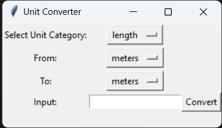

# Unit Converter GUI

A simple Python GUI application for unit conversion.

## Details

This GUI application allows you to easily convert various units across different categories, such as length, mass, time, temperature, electric current, and more. The application provides an intuitive interface for selecting the unit category, the "from" and "to" units, and inputting the value to be converted.

## Features

- User-friendly interface for selecting unit categories and conversion units.
- Supports a wide range of unit categories, including length, mass, time, temperature, and more.
- Real-time conversion results displayed in the GUI.
- Easy-to-use and intuitive design.

## Getting Started

To use the Unit Converter GUI, follow these steps:

1. Make sure you have Python installed on your system.
2. Clone this repository or download the source code.
3. Open a terminal or command prompt and navigate to the project directory.
4. Run the following command to launch the GUI: python unit_converter.py

## How to Use

1. Select the desired unit category from the dropdown menu.
2. Choose the "from" and "to" units for conversion.
3. Enter the value you want to convert in the input field.
4. Click the "Convert" button to see the conversion result.

## Screenshots

## Contributions

Contributions are welcome! If you find any issues or have suggestions for improvements, feel free to create a pull request or submit an issue.

## License

This project is licensed under the [MIT License](LICENSE).

## Acknowledgements

Special thanks to the tkinter library for providing the GUI framework, and to the Python community for their valuable contributions and support.
